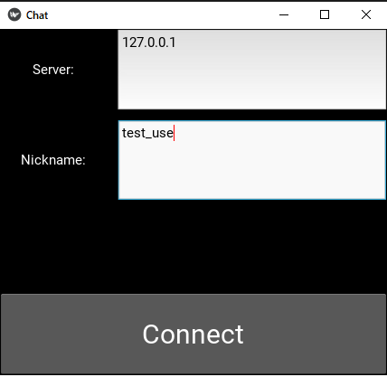
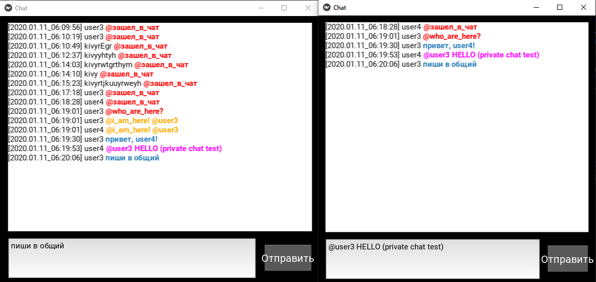

# Kivy-RabbitMQ_Chat
Для создания пользовательского интерфейса использована библиотека Kivy.

main.py - точка входа.
## Вход в приложение
  - Server -- IP адрес сервера с брокером RabbitMQ (почтовый ящик)
  - Nickname -- имя почтового ящика/отправителя 
  

## Окно группового чата
История сообщений группового чата хранится в ScrollWidget. Новые сообщения добавляются снизу, чтобы просмотреть старые сообщения нужно скроллить вверх.
  

## Message Routings:
Каждый тип сообщения закрашивается в определенный цвет в зависимости от routing_key.
  - Сервисные сообщения:
    - Публичные:
      - @who_are_here? - получить список пользователей онлайн;
      - @зашел_в_чат - генерируется при входе в чат.
    - Приватные:
      - @i_am_here! - автоматический ответ на @who_are_here?.
  - Приватные сообщения - адресуются конкретным потребителям через обменник amq.direct;
  - Публичные сообщения - рассылаются всем через обменник amq.famout.
  
Сервисные сообщения удаляются из очереди сразу после доставки потребителю. Остальные сообщения удаляются из очереди через 24 часа.
