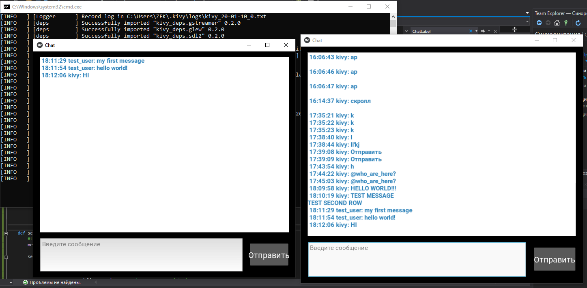

# Kivy-RabbitMQ_Chat
Для создания пользовательского интерфейса использована библиотека Kivy.
## Вход в приложение
  - Server -- IP адрес сервера с брокером RabbitMQ (почтовый ящик)
  - Nickname -- имя почтового ящика/отправителя 
  

## Окно группового чата
История сообщений группового чата хранится в ScrollWidget. Новые сообщения добавляются снизу, чтобы просмотреть старые сообщения нужно скроллить вверх.

